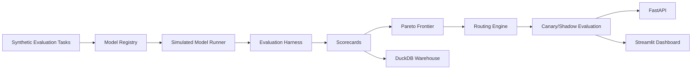
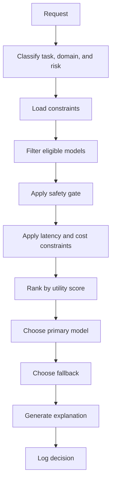
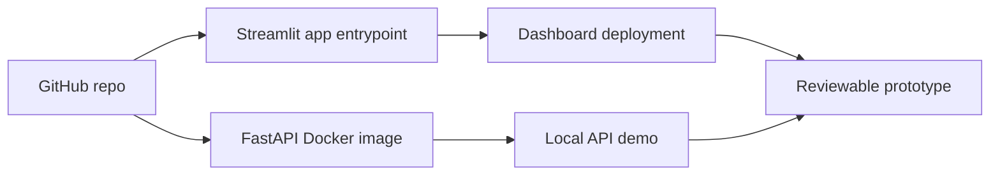

# Foundation Model Evaluation & Routing Control Plane

<!-- REPOSITORY_POLISH_START -->
## Why I Built This

I built this to model the routing layer that sits between AI applications and model providers.

The key challenge I wanted to capture was the part that usually gets hidden in simple demos: how data, signals, decisions, constraints, evidence, and operating risk move through a system that someone else could inspect and run locally.

I intentionally kept this version local and synthetic because the goal is to make the architecture and tradeoffs reviewable without external services, private data, paid APIs, or cloud setup.

## Real Business Problem

Enterprise AI teams use multiple models, and the right model depends on task type, quality bar, cost, latency, safety, and business risk.

This matters because production teams do not only need outputs. They need evidence, ownership, repeatable validation, failure modes, and a path from local prototype to governed production system.

## What This Project Proves

- model evaluation
- model routing
- MLOps scorecards
- constraint-aware routing
- canary/shadow analysis
- deployment prototyping
- production-style data pipeline design
- synthetic but realistic data modeling
- scorecard generation
- API/dashboard serving
- testable architecture
- honest limitation framing

## Architecture In Plain English

Synthetic tasks are evaluated across simulated model candidates, converted into scorecards, compared on Pareto frontiers, routed under constraints, and served through API/dashboard layers.

The important pattern is that inputs are not just transformed into outputs. They are turned into scored, documented artifacts that can be reviewed by operators, analysts, engineers, and business stakeholders.

## Key Design Decisions

- Synthetic data keeps the repo safe to run and share publicly.
- Deterministic local logic makes validation repeatable without paid APIs.
- DuckDB or local artifacts provide warehouse-style inspection without cloud setup.
- FastAPI shows how the system could be served as a service layer.
- Streamlit gives reviewers a fast way to inspect the outputs visually.
- Scorecards make quality, risk, reliability, or readiness measurable.
- Tests and Ruff keep the repo from being only documentation.
- Docker/CI files show the intended deployment shape without claiming production readiness.

See [docs/design-decisions.md](docs/design-decisions.md) for the detailed tradeoff record.

## Validation Evidence

Latest validation run: 2026-06-02.

- Pipeline: passed
- Pytest: passed (92 tests)
- Ruff: passed
- Repository quality docs check: passed
- Detailed command output is recorded in [docs/validation-log.md](docs/validation-log.md).

## Generated Artifacts To Inspect

- evaluation tasks
- model registry
- model cards
- scorecards
- routing decisions
- Pareto reports
- canary/shadow reports
- DuckDB warehouse

## How To Review This Repo

Recruiter / hiring manager:
- Read this README first.
- Review [docs/recruiter-summary.md](docs/recruiter-summary.md) if present.
- Check [docs/validation-log.md](docs/validation-log.md).
- Use [docs/repo-review-guide.md](docs/repo-review-guide.md) for the quickest path.

Senior engineer:
- Review the architecture docs.
- Inspect the `src/` modules.
- Inspect tests and generated scorecards.
- Read [docs/design-decisions.md](docs/design-decisions.md) and [docs/tradeoffs-and-simplifications.md](docs/tradeoffs-and-simplifications.md).

Interview path:
- Run the pipeline command from the validation log.
- Launch the dashboard or API if this repo includes them.
- Explain one design decision and one simplification honestly.

## Known Limitations

- Synthetic data only.
- Local prototype rather than deployed production system.
- Deterministic rules or simulations where a production system may use live models, streaming data, or enterprise integrations.
- No real sensitive data is used.
- No authentication, RBAC, secrets management, or production security boundary unless explicitly stated elsewhere in the repo.
- External systems are simulated instead of connected live.

## Production Roadmap

- add real provider adapters
- integrate MLflow/LiteLLM
- add OpenTelemetry
- enforce tenant budgets
- deploy authenticated routing API

See [docs/production-roadmap.md](docs/production-roadmap.md) for the staged roadmap.
<!-- REPOSITORY_POLISH_END -->


## Executive Summary

This project simulates a production model gateway that evaluates and routes requests across multiple foundation-model-style candidates.

A basic ML project asks:
"Can this model make predictions?"

This project asks:
"Which model should serve this request given quality, latency, cost, safety, reliability, and business constraints?"

Large enterprises rarely use one model for everything. They need a routing layer that can evaluate model quality by task type, enforce latency and budget constraints, prefer safer models for high-risk domains, route low-risk requests to cheaper models, fall back when the preferred model fails, detect regressions before rollout, compare canary versus production models, explain routing decisions, and monitor model portfolio health.

Positioning line:

> I build model evaluation and routing infrastructure that chooses the right model for each task based on quality, latency, cost, safety, and business risk.

## Business Problem

Enterprise AI teams operate many models: fast small models, accurate large models, safety-guarded models, domain finance models, domain healthcare models, cheap batch models, fallback models, and experimental canary models.

Each model has tradeoffs across quality, latency, cost, safety, reliability, task fit, domain fit, and regression risk. Without a model routing control plane, teams either overpay for every request, use unsafe models for high-risk tasks, violate latency SLAs, or fail to detect model regressions before rollout.

## Project Goal

Build a local prototype that:

- generates synthetic evaluation tasks
- simulates multiple model candidates
- evaluates models across task/domain slices
- calculates scorecards
- computes Pareto frontiers
- routes requests based on constraints
- explains model choices
- runs canary and shadow evaluations
- exposes FastAPI endpoints
- provides a Streamlit dashboard for demo/deployment

## Architecture



## Routing Decision Flow



## Evaluation Flow


## Deployment Prototype Flow



## Key Features

- Synthetic task/evaluation dataset generation
- Model registry with candidate model metadata
- Simulated model outputs and metrics
- Evaluation harness
- Quality, latency, cost, safety, and reliability scoring
- Task/domain slice evaluation
- Constraint-aware routing
- Pareto frontier analysis
- Canary model evaluation
- Shadow traffic simulation
- Fallback policy simulation
- Routing explainability
- Model regression detection
- API service layer
- Streamlit dashboard
- Docker and GitHub Actions
- pytest and ruff validation

## Quickstart

```bash
python -m venv .venv
source .venv/bin/activate
pip install -r requirements.txt
python -m src.pipeline.run_all
python -m pytest
python -m ruff check .
```

## Conda Setup

```bash
conda create -n model-routing-plane python=3.12 -y
conda activate model-routing-plane
pip install -r requirements.txt
python -m src.pipeline.run_all
```

## Local Dashboard

```bash
streamlit run src/dashboard/app.py
```

The dashboard includes executive overview, model registry, leaderboard, slice analysis, routing lab, Pareto frontiers, canary/shadow evaluation, monitoring, scorecards, and deployment readiness.

## Local API

```bash
uvicorn src.api.main:app --reload
```

Important endpoints:

- `GET /health`
- `GET /model-registry`
- `GET /model-leaderboard`
- `GET /evaluation-summary`
- `GET /routing-decisions`
- `GET /pareto-frontier`
- `GET /canary-report`
- `GET /monitoring-summary`
- `GET /scorecards`
- `POST /route-request`
- `POST /evaluate-model`
- `POST /simulate-routing-batch`
- `POST /compare-models`

## Docker

```bash
docker build -t model-routing-plane-api .
docker run -p 8000:8000 model-routing-plane-api
```

Or:

```bash
docker compose up --build
```

## Streamlit Community Cloud Deployment

- Push this repo to GitHub.
- Deploy from Streamlit Community Cloud.
- Entrypoint: `src/dashboard/app.py`.
- Requirements file: `requirements.txt`.
- No secrets are required.
- The app loads generated sample data; run `python -m src.pipeline.run_all` locally before committing artifacts.

## Generated Outputs

- `data/evaluation/evaluation_tasks.csv`
- `data/evaluation/routing_demo_requests.csv`
- `data/model_outputs/model_registry.csv`
- `data/model_outputs/simulated_model_outputs.csv`
- `data/scorecards/model_evaluation_report.json`
- `data/scorecards/model_slice_report.csv`
- `data/scorecards/model_leaderboard.csv`
- `data/routing/routing_decisions.csv`
- `data/routing/routing_decision_explanations.json`
- `data/scorecards/pareto_frontier_report.csv`
- `data/canary/canary_evaluation_report.csv`
- `data/shadow/shadow_traffic_report.csv`
- `data/monitoring/model_monitoring_report.csv`
- `data/warehouse/model_routing_plane.duckdb`

## Scorecards

- Model evaluation report
- Model slice report
- Model leaderboard
- Routing quality report
- Pareto frontier report
- Canary rollout decision
- Model health scorecard
- Deployment readiness report

## Validation

V0.1 target:

- 2,000 synthetic evaluation tasks
- 250 routing demo requests
- 10 simulated model candidates
- 20,000 model/task simulated outputs
- 80+ tests
- Ruff checks passing
- API and dashboard launchable locally

## Known Limitations

- Synthetic evaluation data only
- Simulated model outputs, not real LLM APIs
- No real cloud deployment by default
- No real model provider integration
- No authentication
- No production traffic
- No real privacy/security controls beyond simulation

## Future Enhancements

- OpenAI, Anthropic, and Gemini provider adapters
- LiteLLM-style model gateway
- MLflow model registry integration
- OpenTelemetry tracing
- Prometheus/Grafana metrics
- Real-time routing service
- Auth and tenant-aware routing
- Cost budget enforcement
- Streaming logs
- Cloud deployment
- Kubernetes autoscaling
- Production model canary rollout

## STAR Story

### Situation
Enterprises use many AI models with different quality, latency, cost, safety, and reliability profiles. Selecting the same model for every request creates cost waste, safety risk, latency violations, and hidden regression exposure.

### Task
Build a local model evaluation and routing control plane that compares models, generates scorecards, routes requests under constraints, explains decisions, and simulates canary/shadow rollout risk.

### Action
Created synthetic evaluation tasks, model registry metadata, deterministic simulated model outputs, evaluation scorecards, Pareto analysis, constraint-aware routing, fallback decisions, canary/shadow reports, monitoring scorecards, API endpoints, Streamlit dashboard, Docker, CI, and tests.

### Result
Produced a reproducible AI/ML infrastructure portfolio project that demonstrates model evaluation, routing, scorecards, governance constraints, and deployment-ready prototyping.

## LinkedIn Post Draft

See [docs/linkedin-post.md](docs/linkedin-post.md).

<!-- FUTURE_ENHANCEMENT_SCORECARD_START -->
## Future Enhancement Readiness

I added a small readiness scorecard so the production roadmap is not just prose. The check reads `config/future_enhancements.json`, verifies the repo has the expected roadmap/review artifacts, and writes:

- `data/scorecards/future_enhancement_readiness.json`
- `data/scorecards/future_enhancement_readiness.csv`

Run it with:

```bash
python scripts/generate_future_enhancement_scorecard.py
```

This is a local planning signal, not a claim that the repository is production-ready.
<!-- FUTURE_ENHANCEMENT_SCORECARD_END -->

