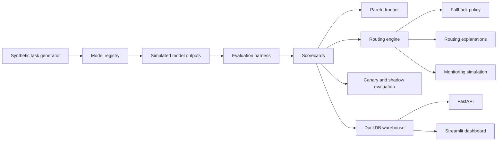

# Architecture

The control plane is deterministic by design. It simulates the infrastructure around foundation models without calling real model providers.

Core components:

- Synthetic task generator: creates evaluation tasks, routing requests, golden answers, and slices.
- Model registry: stores model metadata, intended use, limitations, stage, cost, latency, and safety profile.
- Simulated model runner: creates repeatable model/task outputs.
- Evaluation harness: calculates quality, safety, latency, cost, reliability, format, refusal, timeout, and error metrics.
- Routing engine: filters models by support and constraints, ranks utility, chooses primary and fallback, and writes explanations.
- Canary/shadow simulation: compares experimental model behavior against production baselines.
- Monitoring: simulates portfolio health, fallback rate, cost burn, and routing drift.
