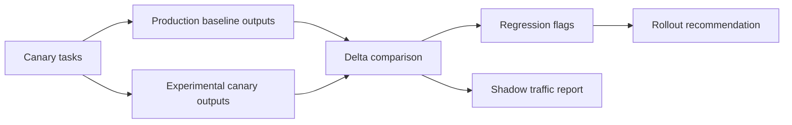

# Canary And Shadow Flow

```mermaid
flowchart LR
  A["Canary tasks"] --> B["Production baseline outputs"]
  A --> C["Experimental canary outputs"]
  B --> D["Delta comparison"]
  C --> D
  D --> E["Regression flags"]
  E --> F["Rollout recommendation"]
  D --> G["Shadow traffic report"]
```

The canary model can improve average quality while still being blocked from broad rollout if it regresses on sensitive slices.
