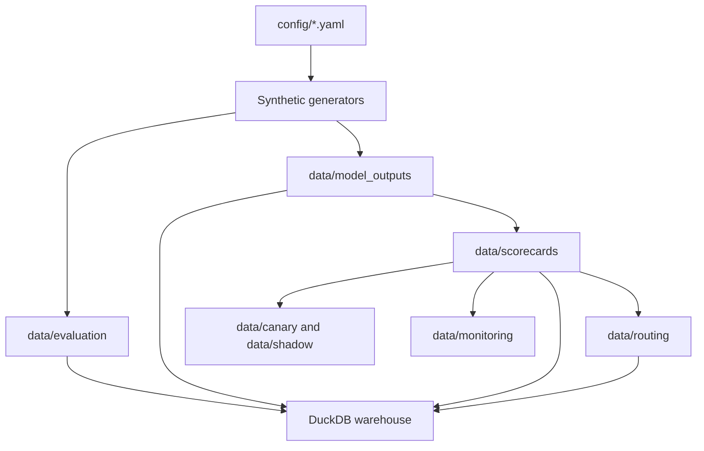

# Data Flow

```mermaid
flowchart TD
  A["config/*.yaml"] --> B["Synthetic generators"]
  B --> C["data/evaluation"]
  B --> D["data/model_outputs"]
  D --> E["data/scorecards"]
  E --> F["data/routing"]
  E --> G["data/canary and data/shadow"]
  E --> H["data/monitoring"]
  C --> I["DuckDB warehouse"]
  D --> I
  E --> I
  F --> I
```

Generated CSV and JSON artifacts make the system reviewable without needing to run the API.
