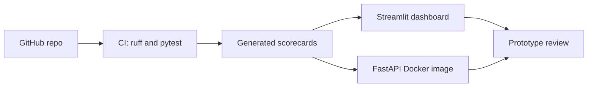

# Deployment Flow

```mermaid
flowchart LR
  A["GitHub repo"] --> B["CI: ruff and pytest"]
  B --> C["Generated scorecards"]
  C --> D["Streamlit dashboard"]
  C --> E["FastAPI Docker image"]
  D --> F["Prototype review"]
  E --> F
```

The project is designed as a local deployment prototype. No API keys or external model providers are required.
