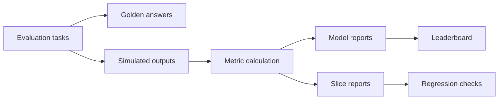

# Evaluation Flow

```mermaid
flowchart LR
  A["Evaluation tasks"] --> B["Golden answers"]
  A --> C["Simulated outputs"]
  C --> D["Metric calculation"]
  D --> E["Model reports"]
  D --> F["Slice reports"]
  F --> G["Regression checks"]
  E --> H["Leaderboard"]
```

The harness evaluates every model against every synthetic task to make comparisons repeatable.
