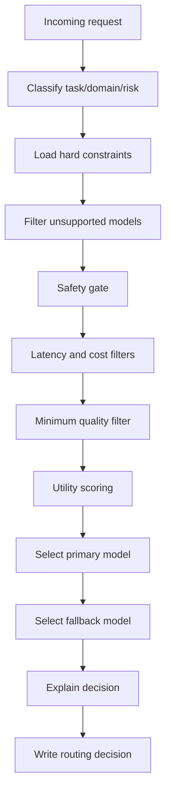

# Routing Flow

```mermaid
flowchart TD
  A["Incoming request"] --> B["Classify task/domain/risk"]
  B --> C["Load hard constraints"]
  C --> D["Filter unsupported models"]
  D --> E["Safety gate"]
  E --> F["Latency and cost filters"]
  F --> G["Minimum quality filter"]
  G --> H["Utility scoring"]
  H --> I["Select primary model"]
  I --> J["Select fallback model"]
  J --> K["Explain decision"]
  K --> L["Write routing decision"]
```

Safety is a hard gate. High quality cannot override a failed safety requirement.
